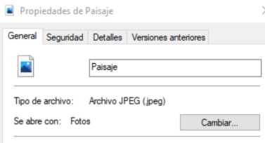
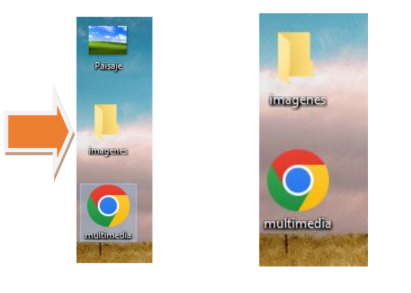
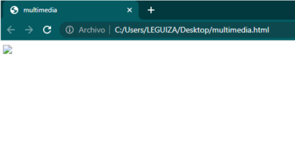
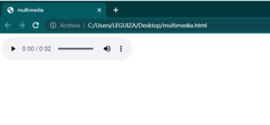
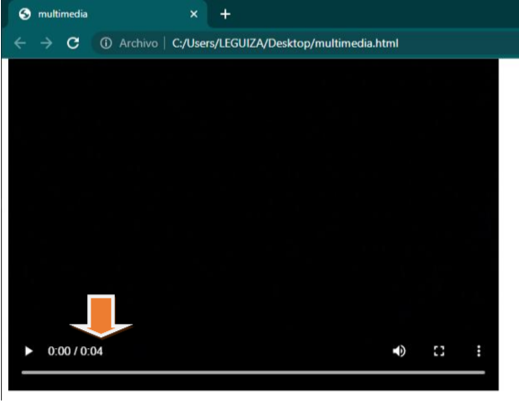
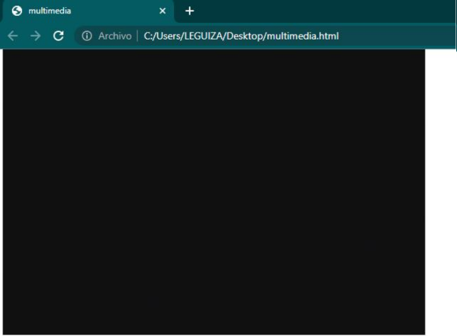
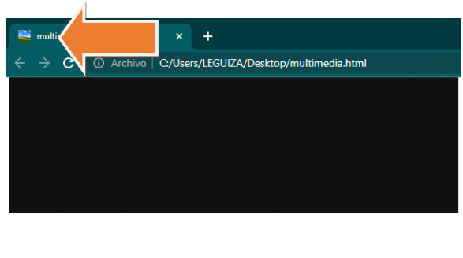

# HTML - img, audio y video.

Las etiquetas multimedia permiten la incorporación de imágenes, sonido y video en nuestras páginas web a través de una serie de etiquetas con atributos específicos.

## Uso de las etiquetas `img`, `audio` y `video`.

En este módulo nos enfocaremos en poner en práctica las etiquetas de imagen, audio y video.

## Etiqueta `img`

Comenzaremos con la etiqueta de imagen `img`. Para insertar una imagen en nuestro código HTML, utilizamos la siguiente sintaxis: 

```HTML

```

<br>

 En este caso, usamos el atributo src (abreviatura de source, que significa "fuente" en inglés), el cual especifica la ubicación o dirección del archivo de la imagen que queremos mostrar.

<br>

El atributo `src` contiene la ruta que indica la ubicación de la imagen que deseamos mostrar en la página web. Esta ruta puede ser relativa o absoluta, de forma similar a como el elemento `<a>` emplea el atributo `href` para enlazar a otras direcciones.

<br>

A continuación, mostraremos cómo se ve nuestra etiqueta en el código HTML:

```HTML
<body>
    </img>
</body>
```

*Resalta en rojo la etiqueta de cierre porque la etiqueta `img` es una etiqueta vacía, es decir, no requiere una etiqueta de cierre, ya que no contiene contenido interno.*

```HTML
<body>
    
</body>
```

Visualmente, no se mostrará ninguna imagen en el documento hasta que proporcionemos una **URL** externa o una ruta local válida que apunte al archivo de imagen.

<br>

Para insertar una imagen alojada en un servidor externo, es necesario utilizar el protocolo de transferencia (como `https://`), seguido de `//` y el nombre de dominio. Por ejemplo: `https://www.google.com`, seguido del resto de la ruta que lleva al archivo de imagen.

<br>

Para insertar una imagen desde nuestro propio equipo, basta con indicar la ruta donde se encuentra el archivo. Es fundamental asegurarse de que el archivo tenga una extensión de imagen válida, como `.jpg`, `.jpeg` o `.png`.

<br>

Como por ejemplo, utilizaremos una imagen llamada *Paisaje* con la extensión `.jpeg`.



Para que el siguiente ejemplo funcione correctamente, la imagen y el archivo HTML deben estar ubicados en la misma carpeta.

En el atributo `src` de la etiqueta `img`, debemos escribir el nombre del archivo de imagen, que en este caso es `Paisaje`, seguido de su extensión: `Paisaje.jpeg`.

Veamos el código a continuación:

```HTML
<body>
    
</body>
```

Veamos nuestro documento HTML:


Sigamos con otro ejemplo. Si guardamos la imagen `Paisaje` dentro de una carpeta, la ruta del archivo cambiará, y en consecuencia, también deberá cambiar el valor del atributo `src`. A continuación, crearemos una nueva carpeta para almacenar la imagen y luego escribiremos el código necesario para que el atributo `src` apunte correctamente al archivo `Paisaje`.



Codificación HTML:
```HTML
<body>
    
</body>
```
Veamos el resultado en el documento HTML:


Ahora realizaremos un ejemplo para observar qué ocurre con la etiqueta `img` cuando no se actualiza correctamente la ruta en el atributo `src`.

En el código HTML, eliminaremos la parte que hace referencia a la carpeta `imagenes/` y dejaremos únicamente `Paisaje.jpeg` como valor del atributo `src`.
<br>
Veamos el código a continuación:

```HTML
<body>
    
</body>
```

Vista en el documento HTML:



Cuando aparece un ícono de imagen rota, significa que el navegador intento cargar el archivo especificado en la etiqueta `img`, pero no pudo encontrarlo. Este tipo de error puede ser grave en una página web, ya que afecta a la experiencia del usuario y puede impactar negativamente en el índice de calidad del sitio. La solución ideal sería corregir la ruta del archivo en el atributo `src`. Sin embargo, si no es posible modificar la ruta, existe una alternativa útil: utilizar el atributo `alt`.

El atributo `alt` sirve para proporcionar un texto alternativo o una descripción de la imagen. Es una buena práctica incluirlo siempre en las etiquetas `img`, ya que mejora la accesibilidad y ofrece información útil cuando la imagen no se puede mostrar. 

En esta caso, añadiremos el atributo `alt` a nuestra etiqueta `img` y escribiremos como valor el texto: `Paisaje`.

```HTML
<body>
    
</body>
```

En nuestro documento HTML, seguirá apareciendo el icono de una imagen rota, pero visualmente también veremos su descripción que dice `Paisaje`.

## Etiqueta `audio`

El uso de la etiqueta `audio` es muy similar al de la etiqueta `img`. Al igual que con las imágenes, se utiliza el atributo `src` para indicar la ruta del archivo de audio, y el atributo `alt` puede emplearse para proporcionar un texto descriptivo alternativo (aunque no es estándar en `audio`). Además, en la etiqueta `audio` es necesario incluir el atributo `controls` para que el navegador muestre los controles de reproducción, como reproducir, pausar o ajustar el volumen.

Nota: Técnicamente, el atributo `alt` no se usa en la etiqueta `audio`. Si lo deseas, puedo ayudarte a corregir esa parte con una explicación más precisa sobre cómo se maneja el contenido alternativo en audio. ¿Te gustaría que lo aclare?

En HTML, la etiqueta `audio` no utiliza el atributo alt. A diferencia de la etiqueta `img`, que sí usa alt para mostrar un texto alternativo cuando la imagen no se carga, en el caso de `audio`, el contenido alternativo se coloca entre las etiquetas de apertura y cierre (<audio>...</audio>).

Este contenido se muestra solo si el navegador no admite la reproducción de audio, funcionando como una alternativa para el usuario.

```html
<body>
    <audio src="audio.mp3" controls>
        Tu navegador no soporta la reproducción de audio.
    </audio>
</body>
```
En este caso, si el navegador no puede reproducir el audio, se mostrará el texto "Tu navegador no soporta la reproducción de audio."

Documento HTML:



## Etiqueta `video`

Ahora solo nos queda trabajar con la etiqueta `video`. Su uso es muy similar al de la etiqueta `audio`, pero en este caso incluiremos algunos atributos adicionales que resultan muy útiles para mejorar la experiencia del usuario.

```HTML
<body>
    <video src="video.mp4" controls></video>
</body>
```
Documento HTML:



Ahora veamos la misma etiqueta, pero sin el atributo `controls`.

Código:
```html
<body>
    <video src="video.mp4"> </video>
</body>
```
Documento HTML:


Al quitar el atributo `controls`, veremos la primera imagen del video pero no tendremos la opción de controlar la reproducción del mismo.

*El atributo alt fue diseñado específicamente para contenido no multimedia, como imágenes, donde se necesita mostrar una descripción alternativa si el archivo no se carga. En cambio, tanto en <video> como en <audio>, el contenido alternativo se escribe dentro de la etiqueta, entre la apertura y el cierre.*

```HTML
<body>
    <video src="ejemplo.mp4" controls>
        Tu navegador no soporta la reproducción de video.
    </video>
</body>
```

## Otros atributos útiles que podemos utilizar en la etiqueta `video`

- `autoplay` Inicia la reproducción del video automáticamente al cargar la página.

- `loop` Hace que el video se reproduzca nuevamente desde el principio automáticamente después de finalizar.

- `muted`Hace que el video se inicie en modo silencioso (sin sonido) al cargar la página.

## Contenido adicional: Agregar un ícono a la pestaña del navegador

Ahora aprenderemos cómo añadir un ícono a la pestaña del navegador utilizando la etiqueta `link`. Para ello, debemos establecer el atributo rel con el valor `shortcut icon` y, además, utilizar el atributo href para indicar la ruta del archivo de imagen que deseamos usar como ícono.

## ¿Qué es el shortcut icon o favicon en HTML?

El favicon es un pequeño ícono que representa visualmente un sitio web. Aparece en la pestaña del navegador, junto al título de la página, y también cuando el sitio se guarda como favorito o marcador. Ayuda a mejorar la identidad visual y la experiencia del usuario.

A continuación, veamos un ejemplo en HTML:

```html
<head>
    <link rel="shortcuticon" href="Paisaje.jpeg">
</head>
```
Cuando ingresamos una imagen como icono de pestaña, podemos utilizar cualquier formato de imagen, pero es una buena práctica convertir la imagen a la extensión `.ico`. Para hacer esto, aquí les comparto un sitio web donde pueden realizar esta conversión:

<a href="https://imagen.online-convert.com/es/convertir-a-ico">https://imagen.online-convert.com/es/convertir-a-ico</a>

Documento HTML:



